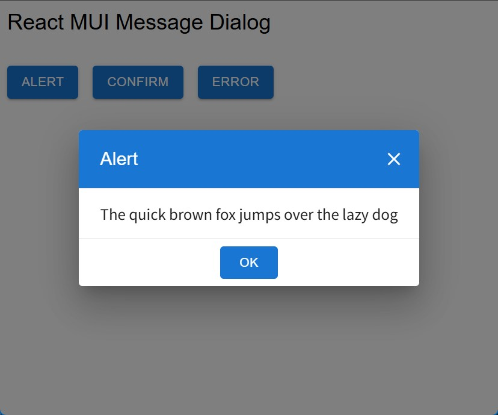
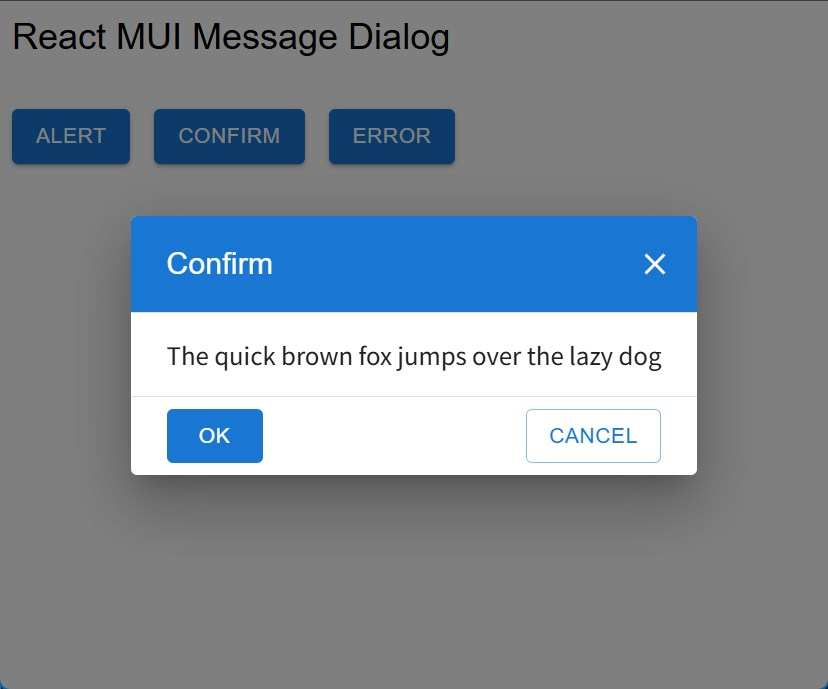
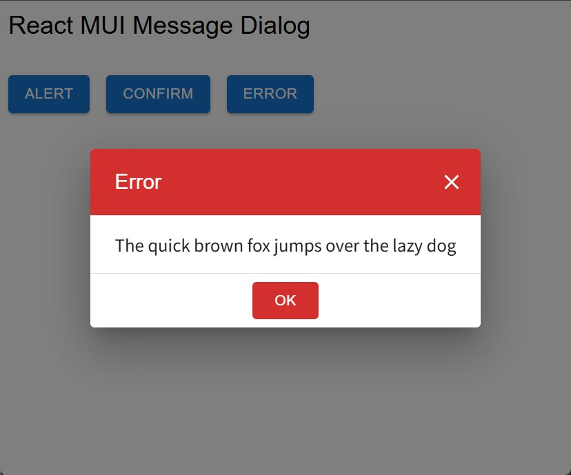

# react-mui-message-dialog

# Overview

`react-mui-message-dialog` is a simple and flexible message dialog component library for React + MUI (Material-UI) environments.

- Unified UI based on MUI's Dialog component
- Promise-based API for easy alert, confirm, and error dialogs
- Global dialog management via Context Provider
- TypeScript support

Ideal for business applications and admin dashboards where you need to display messages or confirmations to users.

# Install

```bash
npm i @jhelom/react-mui-message-dialog
```

# Usage

Wrap your application with `MessageDialogProvider` to enable global message dialog functionality. This provider manages the dialog state and allows you to use the `useMessageDialog` hook anywhere in your component tree.

```tsx
import { MessageDialogProvider } from "@jhelom/react-mui-message-dialog";

createRoot(document.getElementById("root")!).render(
  <StrictMode>
    <MessageDialogProvider>
      <App />
    </MessageDialogProvider>
  </StrictMode>
);
```

After wrapping your app with `MessageDialogProvider`, you can use the `useMessageDialog` hook in any component. This hook provides functions to show alert, confirm, and error dialogs as Promises, making it easy to handle user interactions asynchronously.

```tsx
import { useMessageDialog } from "@jhelom/react-mui-message-dialog";

const messageDialog = useMessageDialog();

// Show an alert dialog
await messageDialog.alert("Alert Message");

// Show a confirm dialog
const result = await messageDialog.confirm("Confirm Message");
if (result) {
  // OK
} else {
  // Cancel
}

// Show an error dialog
await messageDialog.error("Error Message");
```

## Alert



## Confirm



## Error



# Localize Text

You can localize the dialog texts (button labels and titles) by passing a `MessageDialogSettings` object to the `settings` prop of `MessageDialogProvider`. Set each property to the desired language string to customize the dialog UI for your users.

```tsx
import {
  MessageDialogProvider,
  MessageDialogSettings,
} from "@jhelom/react-mui-message-dialog";

const messageDialogSettings = {
  okText: "OK",
  cancelText: "Cancel",
  alertTitle: "Alert",
  confirmTitle: "Confirm",
  errorTitle: "Error",
} as MessageDialogSettings;

createRoot(document.getElementById("root")!).render(
  <StrictMode>
    <MessageDialogProvider settings={messageDialogSettings}>
      <App />
    </MessageDialogProvider>
  </StrictMode>
);
```
